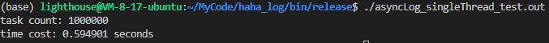
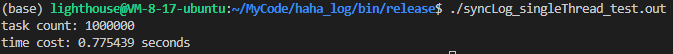
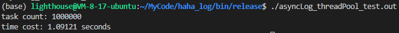

# haha_log
一个高性能的日志系统，借鉴muduo，但总体结构仿效sylar

## 性能测试

### 测试环境
- 腾讯云轻量级应用服务器 
- 处理器 Intel(R) Xeon(R) Platinum 8255C CPU @ 2.50GHz 
- 核心数 2核
- 内存 4G
- 硬盘 80G

### 测试1: 单线程下打印100万条日志

* 同步日志耗时

* 异步日志耗时

### 测试2: 4线程的线程池打印100W条日志

* 同步日志耗时

* 异步日志耗时

### 测试结果汇总

| 日志器类别 | 单线程100W条日志用时 | 4线程线程池100W条日志耗时 |
| ---------- | -------------------- | ------------------------- |
| 同步     | 0.8s左右           | 3s左右                  |
| 异步     | 0.6s左右           | 1s左右                  |

### 总结

结果稍逊于muduo，未来会做些优化

## 编写过程中遇到的一些问题和总结

* 智能指针是个好东西，可以减轻内存管理的负担，但不能滥用！

    日志系统起初所有参数都传的智能指针，但效率很低，100W条日志竟然要花300ms在传参上，这可能是因为智能指针拷贝的开销，以及引用计数的开销。

* 务必小心一些系统调用函数所带来的开销，比如我所碰到的
    - getpid函数获取线程id，每次都调用也会是巨大的开销（100W条日志耗时300ms），因此我就把结果存到一个thread_local变量里，这样就不用每次都调用了。
    - localtime函数也会带来不小的开销，目前用gmtime替代，但不知道会不会出问题。